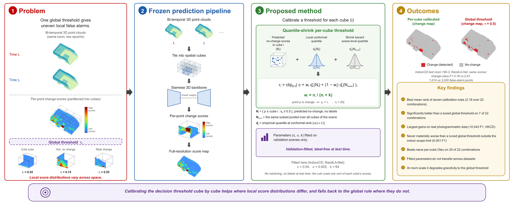

# Quantile-Shrink: Distribution-Free Per-Cube Threshold Calibration for 3D Point Cloud Change Detection

Code, calibration outputs and result tables for the paper:

> D. Šeljmeši, V. Ilić, V. Brtka, D. Dobrilović, E. Brtka, V. Ognjenović.
> *Distribution-Free Per-Cube Threshold Calibration for Deep 3D Point Cloud Change Detection.*
> Under review. `[DOI to be added on acceptance]`

Deep Siamese networks for bi-temporal 3D change detection produce a per-point change
score, and then almost universally compare it against **one global threshold**, usually
0.5, even though local score distributions vary strongly across a scene. This repository
contains the first systematic study of that decision, benchmarking **seven threshold
calibration rules** across **six models**, **four datasets** and **22 model-dataset
combinations**, plus the proposed per-cube rule.



*IndoorCD test room `190-3`, frozen RandLA-Net predictions. Thresholding each cube at its
own shrunk conformal quantile instead of the global 0.5 raises change-class F1 from 0.611
to 0.780 and cuts false alarms from 3,030 to 1,014 points. No panel is a mockup; every
one is rendered from the released artefacts by `paper/graphical_abstract/`. This is a
showcase scene; for the benchmark-wide picture, which is a rank win rather than a uniform
one, see [Results](#results-at-a-glance).*

---

## The method

The scene is tiled into cubes. Within cube *i*, the no-change subset is identified from
**raw model predictions** (never labels), and the threshold is the conformal-rank
quantile of that subset, shrunk toward the scene-level quantile so that small cubes do
not follow their own noise:

```
tau_i = clip[0,1]( c + w_i * q_alpha(nochange_i) + (1 - w_i) * q_alpha(nochange_scene) )

w_i   = n_i / (n_i + k)                     n_i = no-change point count of cube i
q_alpha = empirical quantile at conformal rank ceil(alpha * (n + 1))
```

Three scalars `(c, alpha, k)` are fitted **once per model-dataset pair** on the validation
scenes by exhaustive grid search (61 x 14 x 7 = 5,978 candidates) maximizing mean
per-scene change-class F1. No labels, no retraining and no architectural change are
involved at test time; the rule costs one sort of each cube's scores.

As `k -> infinity` every cube collapses onto the scene quantile, so the tuned global
threshold is a limiting case of this family. That is why the honest headline is a
**rank win, not a uniform win**; see [Results](#results-at-a-glance).

No Chamfer distance is used anywhere. Only model output scores and logits.

---

## What is in this repository, and what is not

The full artefact set is 70 GB, which does not belong on GitHub. The split is:

| | Location | Size |
|---|---|---|
| Source code, configs, frozen splits | this repo | ~1 MB |
| Per-scene calibration outputs (176 JSON) | this repo, `calibration/`, `calibration_v2/` | ~5 MB |
| All result tables and paper figures | this repo, `results/` | ~3 MB |
| Training and inference logs (47 runs) | this repo, next to each model | ~350 KB |
| **Frozen per-scene predictions** (1,263 `.npz`) | Zenodo `[DOI to be added]` | 13 GB |
| **Ablation predictions** (2,666 `.npz`) | Zenodo `[DOI to be added]` | 45 GB |
| **Model checkpoints** (95 `.pt`) | Zenodo `[DOI to be added]` | included above |
| Raw datasets | original providers, see [Datasets](#datasets) | 10 GB |

Every table and figure in the paper is CPU-reproducible from the Zenodo prediction
archive plus this code. Nothing requires a GPU unless you retrain from scratch.

---

## Quickstart: reproduce the paper tables

Reproducing the results needs the prediction archive, not the raw datasets.

```bash
git clone https://github.com/Amanzunge/quantile-shrink-3dcd.git && cd quantile-shrink-3dcd
```

```bash
python -m pip install -r requirements.txt
```

Download the prediction archive from Zenodo and unpack it so that `predictions/` and
`ablations/` sit at the repository root (they already exist here, holding only the logs).
Then:

```bash
python src/calibrate.py --config configs/urb3dcd_v2_ld.yaml
```

```bash
python src/calibrate_v2.py --config configs/urb3dcd_v2_ld.yaml
```

```bash
python src/calibrate_otsu.py --config configs/urb3dcd_v2_ld.yaml
```

Repeat for `urb3dcd_v2_ms.yaml`, `hkcd.yaml` and `indoorcd.yaml`. This rewrites
`results/main_table.csv` (132 rows = 6 rules x 22 combinations),
`results/improved_methods_table.csv` and `results/otsu_baseline_table.csv`, and refreshes
every JSON under `calibration/` and `calibration_v2/`.

Then build the derived tables and figures:

```bash
python src/paper_stats.py --configs configs/urb3dcd_v2_ld.yaml configs/urb3dcd_v2_ms.yaml configs/hkcd.yaml configs/indoorcd.yaml
```

```bash
python src/transfer_v2.py --out results/transfer_table.csv
```

```bash
python src/build_scope_limit_table.py
```

```bash
python src/build_ablation_tables.py --sweep fps
```

```bash
python src/build_ablation_tables.py --sweep cube
```

```bash
python src/plot_paper_v2.py
```

| Script | Produces |
|---|---|
| `calibrate.py` | the five standard rules, `main_table.csv` |
| `calibrate_v2.py` | `quantile`, `quantile_shrink`, `improved_methods_table.csv`, fitted `(c, alpha, k)` per dataset |
| `calibrate_otsu.py` | per-cube Otsu baseline, `otsu_baseline_table.csv` |
| `paper_stats.py` | `significance_table.csv` (paired bootstrap + Wilcoxon), `iou_table.csv` |
| `transfer_v2.py` | `transfer_table.csv`, the cross-dataset negative result |
| `build_scope_limit_table.py` | `scope_limit_table.csv`, the IndoorCD scale floor |
| `build_ablation_tables.py` | `ablation_fps.csv`, `ablation_cube.csv`, `ablation_cube_geometry.csv` |
| `estimator_autopsy.py` | `estimator_autopsy.csv`, split-half headroom analysis |
| `sensitivity.py` | `sensitivity_table.csv`, how sharply the result depends on `(c, alpha, k)` |
| `plot_paper_v2.py`, `plot_ablations.py` | all figures in `results/` |

---

## Full pipeline from raw data

Only needed if you are retraining. Download a dataset (see below), point the config's
`raw_root` at it, then:

```bash
python src/preprocess_cubes.py --config configs/urb3dcd_v2_ld.yaml
```

```bash
python src/train.py --config configs/urb3dcd_v2_ld.yaml --model siamese_pointnet --epochs 60 --batch-size 4 --gpu-fps
```

```bash
python src/predict.py --config configs/urb3dcd_v2_ld.yaml --model siamese_pointnet --ckpt predictions/urb3dcd_v2_ld/siamese_pointnet/best.pt
```

The geometric baseline needs no training:

```bash
python src/predict_icp.py --config configs/urb3dcd_v2_ld.yaml
```

`train.py` supports `--resume` and `--max-hours` so a 60-epoch run can be checkpointed
across several session-limited compute allocations. `--gpu-fps` batches furthest-point
sampling on the GPU (roughly 3x faster per epoch on the large-cube datasets).

### Pipeline steps

1. Axis-aligned bounding box over both epochs.
2. Tile the box with the dataset cube extent.
3. Extract points per cube from both clouds.
4. Drop cubes holding fewer than 256 points in *either* cloud.
5. Dense datasets only (HKCD, IndoorCD): voxel grid-subsample each cube before FPS, then
   FPS to the model-native size. Grid subsampling shrinks only the model input; the
   full-resolution cube is kept for step 7.
6. Siamese forward pass on the cube pair.
7. Nearest-neighbour propagation of scores and logits back to full cube resolution.
8. Save one `.npz` per scene.

### Prediction file schema (frozen)

Every model writes the identical contract, so calibration code is model-agnostic:

| Key | Shape | Dtype | Meaning |
|---|---|---|---|
| `scores` | (N,) | float32 | P(change) per point in the second epoch |
| `logits` | (N, 2) | float32 | raw pre-softmax logits, NN-propagated |
| `labels` | (N,) | int64 | binary ground truth |
| `coords` | (N, 3) | float32 | original unnormalized XYZ |
| `cube_id` | (N,) | int32 | which cube each point belongs to |
| `scene_id` | scalar | str | scene identifier |
| `dataset` | scalar | str | dataset identifier |

---

## Repository layout

```
configs/          one YAML per dataset: cube extent, FPS size, min points, paths
data/splits/      FROZEN train/val/test splits, never resampled
src/
  preprocess_cubes.py   cube slicer, writes the per-scene cache
  dataloader.py         cube-pair loader with train/val/test FPS regimes
  models/               siamese_pointnet, siamese_pointnet2, siamese_kpconv,
                        randla, siamgcn
  train.py              identical 60-epoch recipe for every deep model
  predict.py            writes the frozen .npz contract
  predict_icp.py        ICP + Euclidean geometric baseline
  calibrate.py          fixed 0.5, f1-optimal, temperature, Platt, isotonic
  calibrate_v2.py       quantile, quantile-shrink (the proposed rule)
  calibrate_otsu.py     per-cube Otsu baseline
  transfer_v2.py        cross-dataset parameter transfer
  paper_stats.py        paired bootstrap CIs, Wilcoxon tests, IoU table
  estimator_autopsy.py  split-half headroom, oracle-threshold regression
  sensitivity.py        flatness of the validation optimum, shared-parameter check
  plot_*.py             every figure in the paper
predictions/<dataset>/<model>/       best.pt, per-scene .npz, run logs
calibration/<dataset>/<model>/       per-scene tau and metrics, five standard rules
calibration_v2/<dataset>/<model>/    quantile, quantile-shrink, per-cube Otsu
ablations/<dataset>/{fps,cube}/      FPS and cube-size sweeps, same contract
results/                             all CSV tables and PNG figures
docs/method_theory.md                derivation, coverage argument, shrinkage
```

---

## Experiment matrix

Frozen before any result was read.

| Dataset | Role | Cube extent | FPS native | Models |
|---|---|---|---|---|
| Urb3DCD-V2 LD | primary benchmark, simulated LiDAR | 50 x 50 m x full Z | 1024 | all but RandLA-Net |
| Urb3DCD-V2 MS | density ablation, multi-sensor | 50 x 50 m x full Z | 4096 | all six |
| HKCD | real photogrammetric validation | 50 x 50 m x full Z | 4096 | all six (grid subsample 1.5 m) |
| IndoorCD | deliberate scope-limit control | 1.5 x 1.5 x 1.0 m | 4096 | five deep models |

Models: `icp_euclidean` (no training), `siamese_pointnet`, `siamese_pointnet2`,
`siamese_kpconv`, `randla`, `siamgcn`. RandLA-Net is excluded from LD (insufficient
density at any reasonable cube extent); ICP is excluded from IndoorCD.

Training parity across every deep model, so architecture is the only variable:
60 epochs, Adam at 1e-3 with cosine annealing, batch 4, class-weighted cross-entropy,
seed 42, random FPS per training batch, fixed-seed FPS at test.

Ablations run at the same 60-epoch recipe, not a reduced one: FPS sweep on the simulated
benchmark, cube-size sweep on all four datasets (25/50/75 m outdoors,
1.0/1.5/2.0 m indoors), 66 additional training runs.

---

## Results at a glance

Reported as mean per-scene change-class F1 on test scenes.

- **Best overall mean rank**: 2.16 of seven rules over 22 combinations, ahead of
  temperature scaling (2.75) and the tuned global threshold (2.91); per-cube Otsu is last
  (5.36).
- **Against rules that do not tune a threshold on validation data** (fixed 0.5, Platt,
  isotonic, per-cube Otsu): 17 to 19 wins of 22.
- **Against the tuned global threshold**: 8 wins, 12 ties, 2 losses at a 0.002 tie band.
  Wilcoxon p = 0.079 over the benchmark: a trend, **not** a significant global win. Seven
  individual combinations are significantly positive by paired bootstrap, concentrated on
  the real photogrammetric data (HKCD ICP +0.043, pooled change-IoU 0.457 -> 0.536;
  HKCD SiamGCN +0.021) and on miscalibrated models (MS SiamGCN +0.023, MS KPConv +0.012).
- **Per-cube Otsu collapses** where naive local adaptivity is dangerous, on change-sparse
  cubes whose histogram it splits anyway (up to -0.29 F1). Local thresholds need both the
  validation-fitted offset and the shrinkage.
- **Parameters do not transfer** across datasets: 15 of 16 source-target-model triples
  land below the target's own tuned global threshold. This is a per-dataset procedure
  needing a labelled validation split, not a transferable constant.
- **The ceiling is characterized, not just the method.** Per-cube oracle headroom is real
  under split-half validation (48-73% retained on LD, 68-98% on MS, 66-102% on HKCD,
  84-102% on IndoorCD) and grows as cubes shrink
  (LD PointNet +0.037 / +0.056 / +0.111 at 75 / 50 / 25 m), yet label-free per-cube
  statistics predict the oracle threshold poorly (R^2 <= 0.43). IndoorCD marks the scale
  floor where the per-cube population collapses (median 7 cubes per scene, 78% of cubes
  holding no change at all) and local calibration stops paying.

---

## Datasets

None are redistributed here. Each must be obtained from its original provider under its
own licence.

| Dataset | Source | Notes |
|---|---|---|
| Urb3DCD-V2 (LD + MS) | IEEE DataPort, de Gélis et al., [10.3390/rs13132629](https://doi.org/10.3390/rs13132629) | login-gated; one archive holds both variants |
| HKCD | Zhan et al., PGN3DCD, [10.1109/TGRS.2024.3436854](https://doi.org/10.1109/TGRS.2024.3436854) | ~128M annotated points, ~8.1 km² of Hong Kong |
| IndoorCD | Ciceklidag et al., IEEE DataPort, [10.21227/vhfk-vq69](https://doi.org/10.21227/vhfk-vq69) | converted to PLY by `src/convert_indoorcd.py` |

The frozen splits under `data/splits/` are what make runs comparable; HKCD uses the
official split published with the dataset, and the IndoorCD split is generated once by
`src/freeze_indoorcd_split.py`.

---

## Environment

Analysis is CPU-only and runs on any machine. Python 3.10, packages pinned in
`requirements.txt`.

Training used two environments, both at the identical 60-epoch recipe:

- **National Platform for Artificial Intelligence**, Government Data Centre, Kragujevac,
  Serbia. NVIDIA A100-SXM4 40 GB, one GPU per job, NGC PyTorch 23.08 container, SLURM.
  All 66 ablation runs, ~77 hours wall clock with heavy concurrency.
- Cloud GPU instances with NVIDIA Tesla T4 16 GB, for the 19 main benchmark runs,
  1 to 18 hours per run (median ~6).

---

## Citation

```bibtex
@article{seljmesi2026quantileshrink,
  title   = {Distribution-Free Per-Cube Threshold Calibration for Deep 3D Point Cloud Change Detection},
  author  = {{\v S}eljme{\v s}i, Dalibor and Ili{\'c}, Velibor and Brtka, Vladimir and
             Dobrilovi{\'c}, Dalibor and Brtka, Eleonora and Ognjenovi{\'c}, Vi{\v s}nja},
  year    = {2026},
  note    = {Under review}
}
```

## License

Code released under the MIT License, see [LICENSE](LICENSE). The datasets and the
released prediction artefacts remain under the terms of their original providers.

## Acknowledgements

The authors acknowledge the use of the National Platform for Artificial Intelligence
hosted at the Government Data Centre in Kragujevac, Serbia.
